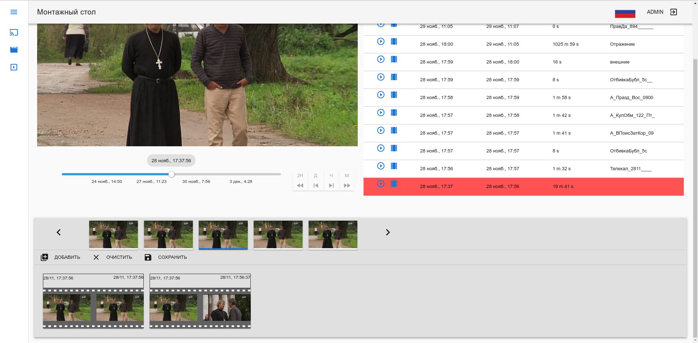

# Видеоредактор
Веб-интерфейс для нарезки телепередач из двухнедельной записи эфира. 

Получая с бекэнда расписание перелач и массив записанного двухнедельного видео производится сопоставление передач видео, вырезаются короткие рекламные вставочки, подгоняются временные рамки начала и конца передачи. После задания отправляются на бекенд, где по этим данным нарезается видео и создается плеер с несколькими качествами в облаке, который возвращается ползьзователю в виде iframe-элемента.

